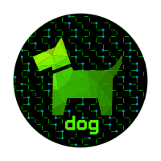

<p align="center">
  
</p>

<h1>dog_park</h1>

dog_park is the web gui component of [dog](https://github.com/Phonebooth/dog),
a centralized firewall management system.

- [Runtime Dependencies](#runtime-dependencies)
- [Build Dependencies](#build-dependencies)
- [Deploy Configuration](#deploy-configuration)
- [Build](#build)
- [Deploy](#deploy)
- [Run](#run)
- [Architecture](#architecture)

## Runtime Dependencies

- linux 4.x+ (Ubuntu 16.04+ tested)
- web server (nginx tested)

## Build Dependencies

- nodejs 24.x+
- yarn 1.16.x+

- Ubuntu:

```bash
#nodejs
curl -fsSL https://deb.nodesource.com/setup_24.x | bash -
apt install nodejs

#yarn
npm install --global yarn
```

## Deploy Configuration

```bash
apt install virtualenv
virtualenv /opt/dog_env
source /opt/dog_env/bin/activate
pip install -r /opt/dog/requirements.txt
cd /opt/dog
ansible.sh
```

## Build

```bash
#VITE_DOG_API_HOST must match certificate address if using https
VITE_DOG_API_HOST='http://localhost:3000' yarn build
cd dist
tar -czvf dog_park.tgz *
```

## Deploy

Copy tar to web server system, extract to web root

## Sample Nginx Configuration

- Protect with an authentication proxy: [oauth2-proxy](https://oauth2-proxy.github.io/oauth2-proxy/)
- Configure your web server to proxy /api to dog_trainer at [http://localhost:7070/api/](http://localhost:7070/api/)

example nginx config:

```nginx
{
  server {
    listen 3000 default_server;
    listen [::]:3000 default_server;

    location /api/ {
        auth_request /oauth2/auth;
        error_page 401 = /oauth2/sign_in;

        # pass information via X-User and X-Email headers to backend,
        # requires running with --set-xauthrequest flag
        auth_request_set $user   $upstream_http_x_auth_request_user;
        auth_request_set $email  $upstream_http_x_auth_request_email;
        proxy_set_header X-User  $user;
        proxy_set_header X-Email $email;

        # if you enabled --cookie-refresh, this is needed for it to work with auth_request
        proxy_pass http://localhost:7070/api/;

        proxy_http_version 1.1;
        proxy_set_header Upgrade $http_upgrade;
        proxy_set_header Connection "upgrade";

        proxy_set_header  Host $host;
        proxy_set_header   X-Real-IP        $remote_addr;
        proxy_set_header   X-Real-Port      $remote_port;
        proxy_set_header   X-Forwarded-Proto $scheme;
    }

    location / {
        root   /opt/dog_park;
        index  index.html index.htm;

        try_files $uri $uri/ /index.html;
    }
}
```

## Run

[http://localhost:3000](http://localhost:3000)

## Architecture

### Stack

- **React 18** with class components and `react-router-dom` v6 for routing
- **Redux Toolkit** for global state management, with `redux-thunk` middleware for async actions and `redux-logger` for console logging
- **MUI v5** (`@mui/material`) for UI components and theming
- **@dnd-kit** for drag-and-drop rule ordering in profiles
- **Vite** as the build tool (outputs to `dist/`)

### State Management

dog_park uses Redux to store global state. When the page loads, calls are made to the plural API endpoints (hosts, groups, profiles, zones, services, and links) and the results are stored in the Redux store. Once loaded, all information is available to the app without further network delays. Any time you drill into a specific resource, an API call fetches that resource's details. When a resource is created or updated, a full refresh of the Redux store is triggered to ensure data is current.

Currently, there is no mechanism for auto-refresh. If the page is left open for a long period of time, the data may be stale relative to dog_trainer's state and a full page refresh is required. There is also no indication of other users actively making changes, so two users modifying the same resource simultaneously could overwrite each other's changes.
